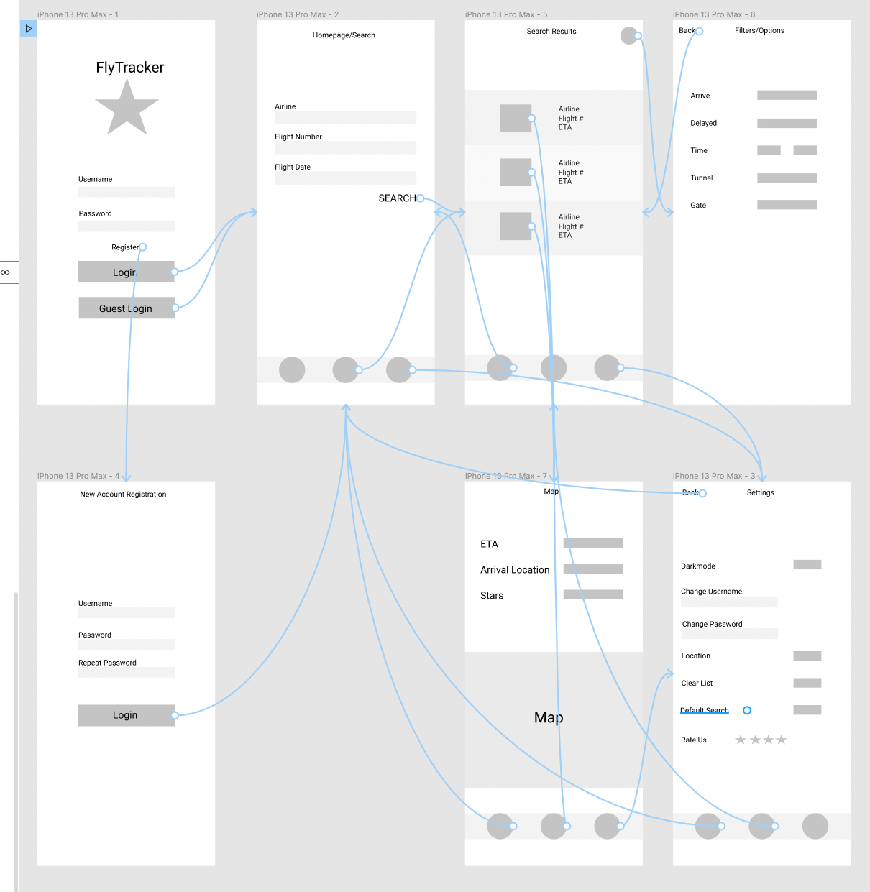
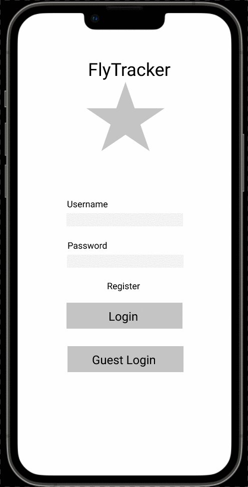

# FLYTRACKERS

## Table of Contents
1. [Overview](#Overview)
1. [Product Spec](#Product-Spec)
1. [Wireframes](#Wireframes)
2. [Schema](#Schema)

## Overview

### Description
Tracks a plane given a plane tail number, flight number, or other identifiable information. Can be used to track your flight status since delays can usually occur during the previous flights your plane has been on, with no knowledge of that being passed to the traveler. 

### App Evaluation
[Evaluation of your app across the following attributes]
- **Category:** Travel
- **Mobile:** This app would be primarily a mobile app to allow quick and easy access while the user is traveling or going about their day. There could be implementation for a website version that includes more features in the long run.
- **Story:** Tracks the given planes a user requests - this could be for plane hobbyists who enjoy following planes, or travelers who would like to know where their plane is or if it is being delayed.
- **Market:** Any traveler or hobbyist.
- **Habit:** This app could be used whenever or wherever the user chose.
- **Scope:** We first test our app with a  group of users siloed into business travelers, frequent travelers, and casual travelers. Based on our feedback, we tailor this app for business or consumer uses. For business, we would add integration with automation services like IFTTT to notify relevant parties of an arrival to schedule pick-ups or adjust meeting times (all this takes place while the passenger is in the air). For vacationers and adventurers, we could keep track of all their flights and create a flight-journal to visualize their travels around the world. 

## Product Spec

### 1. User Stories (Required and Optional)

**Required Must-have Stories**

* User logs in to access the list of planes they're tracking, as well as settings
* User can choose any additional planes to add based on set criteria
* User can see specific aircraft statistics (i.e. how many 737-800's there are heading to Miami)
* Settings (Accessibility, Notifications, General, Dark Mode, Units, etc)

**Optional Nice-to-have Stories**
* Logs of previous flights that were tracked
* Additional statistics based on the user (i.e. Map plot showing their travel history?)
* Random picker of a plane or flight
* Public feed to post interesting data
* Profile Picture
* Chat log with other people following a specific flight? 

### 2. Screen Archetypes

* Login
* Register - User can sign up for an account
   * The user can choose to create a new account, or login in with a previously made account
   * Once logged in, user heads to their main tab view where they can see a list of their tracked flights or planes
* User can see list of their tracked planes or flight
   * After logging in, user sees a list of their flight or planes.
   * User can choose to modify their selected planes
* User can search for a flight or plane based on a set of filters
   * If user finds a plane/flight of interest, can add it to their tracked list
* User can change their personal settings
* [OPTIONAL] User can view a public feed with flights/planes of interest

### 3. Navigation

**Tab Navigation** (Tab to Screen)

* User's plane/flight list
* Search tab
* Profile/Settings Tab

[OPTIONAL] 
* Public feed tab
* Randomized plane/flight suggestion tab

**Flow Navigation** (Screen to Screen)

* User is logged in or allowed to register
* User gets sent to tracked list -> these can be modified or deleted
* User clicks on item in tracked list -> additional details about flight are revealed
* User can search and add to their tracked list, given a wide variety of filters -> list shows only items meeting filter criteria
* Profile/Settings -> users can modify their account or app settings or toggle dark mode

## Wireframes


### [BONUS] Digital Wireframes & Mockups


### [BONUS] Interactive Prototype
[Interactive Prototype](https://www.figma.com/proto/sISDbrzavME1CzvNuvnsmb/FlyTracker?page-id=0%3A1&node-id=2%3A15&viewport=241%2C48%2C0.58&scaling=scale-down&starting-point-node-id=2%3A2)


## Schema 


### Models

#### User Model
| Property | Type | Description
| -------- | ---- | -----------
| userID | Int | Unique ID for user (primary key)
| username | Str | Unique username
| password | Str | Hashed, salted passed for user
| profilePicture | File | User's profile picture
| createdAt | DateTime | Time this user was added

#### Flight Tracking Model
| Property | Type | Description
| -------- | ---- | -----------
| objectID | Int | Unique ID for flight tracking object (primary key)
| author | Int | Points to user who created this (foreign key)
| trackingData | Str | Flight # for tracking
| addedAt | DateTime | Time this tracking object was added

#### Settings Table
| Property | Type | Description
| -------- | ---- | -----------
| userID | Int | Points to user who these settings are for (primary/foreign key)
| darkOrLightMode | Bool | Whether user prefers dark (True) or light (False) mode
| units | Str | Units the user prefers
| language | Str | Language settings this user prefers

## Networking

### List of Network Requests By Tab/View

---

#### LOGIN/REGISTER

##### (Read/GET) Query for user

```swift
// Query for user object
PFUser.logInWithUsername(inBackground: username!, password: password!) {
    (user: PFUser?, error: Error?) -> Void in
    switch error {
        case .some(let error as NSError):
        // No user found, or error on login attempt

        case .none:
        // TODO - User successfully logged in
    }
}
 ```

##### (Create/POST) Create a new user


```swift
// Query for user object
let user = PFUser()
user.username = usernameField.text
user.password = password

user.signUpInBackground { (success, error) in
    switch error {
        case .some(let error as NSError):
            // Error on creating user, duplicate username or other

        case .none:
            // TODO: Login the user, send to feed
    }
}
 ```
---

#### USER’S FLIGHTS TAB

##### (Read/GET) Query for all user’s tracked flights
```swift
// Query for current user's trackings
let currentUser = PFUser.current()!
let query = PFQuery(className: "Trackers")
query.includeKeys(["author"])
query.whereKey("author", equalTo: currentUser)
query.order(byDescending: "addedAt")

query.findObjectsInBackground { (trackings, error) in
    if trackings != nil {
        // Successful retrieval of the user's flight trackings

    } else if let error = error {
        // Something went wrong
    }
}
 ```

##### (Delete) Delete existing tracked flight
```swift
// User selects an object to delete
let objectToDelete = selectedObject as! PFObject

objectToDelete.deleteInBackground { (success, error) in
    if let error = error {
        // Error on deletion

    } else {
        // Successful delete
    }
}
 ```
---

#### SEARCH TAB

##### (Read/GET) [Query API for search based on user’s request](https://www.raywenderlich.com/6587213-alamofire-5-tutorial-for-ios-getting-started#toc-anchor-005)


```swift
// User searches for flights
func searchFlights(for name: String) {
    let url = "https://api.aviationstack.com/v1/flights"
    let access_key = "123"
    let parameters: [String: String] = ["access_key": access_key]

    AF.request(url, parameters: parameters)
        .responseJSON { (data) in data
        print(data)
        // Successful retrieval of data
    }
}
 ```


##### (Create/POST) Save a search result to user’s saved flights

```swift
// User saves a flight from the search results
let currentUser = PFUser.current()!
let tracking = PFObject(className: "Trackings")
let flightNumber = "123"
        
tracking["author"] = currentUser
tracking["trackingData"] = flightNumber

tracking.saveInBackground { (success, error) in
    switch error {
    case .some(let error as NSError):
        // Error on save
        
    case .none:
        // Successful save
    }
}
 ```

---

#### SETTINGS TAB

##### (Create/POST) Change user’s dark mode

##### (Create/POST) Language setting

##### (Create/POST) Units setting

##### (Create/POST) Change profile picture

---

- [OPTIONAL: List endpoints if using existing API such as Yelp]
